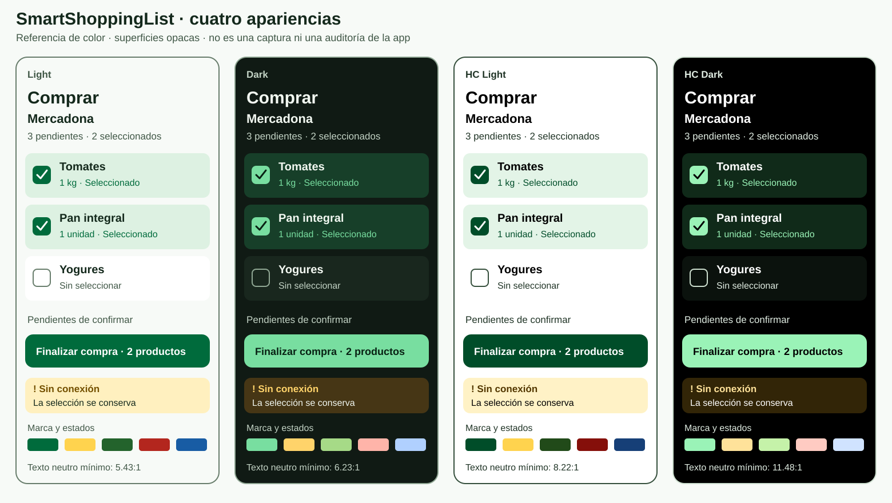

# Sistema de diseño de SmartShoppingList

Versión 2 · 25 de septiembre de 2026 · plataforma mínima: iOS 27.

Estado: **base de color de [#20](https://github.com/JFrancoG/SmartShoppingList/issues/20), con aplicación a las pantallas pendiente**. Los 21 tokens tienen assets de cuatro variantes, acceso semántico y un tinte global compartido. Sus pares se validan matemáticamente; la aplicación a cada vista y componente, y la accesibilidad de la app en ejecución, requieren validación posterior. Este documento no declara conformidad global AA/AAA. Los iconos Brain/Check se incorporan por aprobación del usuario del 24 de septiembre (#16), con alcance y evidencia separados de la integración visual de las pantallas.

Documentos relacionados: [fuentes y novedades verificadas](research/design-system-sources.md), [matriz de contraste generada](validation/design-system-contrast.md), [evidencia de la base visual #20](validation/issue-20-visual-foundation.md), [criterios y ensayo de accesibilidad](accessibility.md), [spec](mvp-spec.md) y [plan](implementation-plan.md).



La [lámina vectorial](assets/design-system-preview.svg) se genera desde los tokens. Ilustra pares sólidos y estados; no reproduce el material nativo, el tamaño táctil o el comportamiento SwiftUI, y no es evidencia de ejecución. El ejemplo de falta de red conserva la selección; la política concreta de habilitación/reintento se verifica en la app.

## 1. Dirección visual y decisiones

El icono candidato `ssl_icon_brain_complete.png` aportado por el usuario inspira una identidad de compra cotidiana: verde de las verduras y el fondo, amarillo de la bolsa, neutros cálidos del asa y rojo del tomate. La paleta es una adaptación semántica con contraste medido, no una extracción literal de píxeles ni una reproducción del degradado del icono.

| Decisión | Aplicación y motivo |
|---|---|
| Verde como acento interactivo | Acción principal, selección provisional y navegación activa; texto, forma y rol distinguen cada uso |
| Amarillo como apoyo de marca | Detalles decorativos o distintivos informativos con tinta oscura; no texto amarillo sobre blanco ni un segundo CTA competidor |
| Éxito, aviso, error e información separados | Verde oliva, ámbar, rojo y azul con símbolos y mensajes explícitos; no se confunde una selección con una compra confirmada |
| Neutros con leve matiz verde | Superficies tranquilas para listas; el contenido tiene prioridad sobre la marca |
| Tipografía y controles del sistema | San Francisco mediante estilos semánticos, SF Symbols, formularios y navegación nativos |
| Cuatro variantes automáticas | Light, Dark, Light con Aumentar contraste y Dark con Aumentar contraste; sin selector de tema adicional en el MVP |
| Contraste de texto ≥4,5:1 en normal y ≥7:1 en HC | Objetivo propio para todo texto informativo, sin depender de la excepción de texto grande |
| Elementos gráficos esenciales ≥3:1 | Medidos frente al fondo adyacente real; no existe una categoría WCAG «AAA para componentes» |
| Contenido sólido; materiales nativos en navegación | Los ratios sRGB no predicen el contraste de un material sobre contenido cambiante |

Las capturas de Saotome orientan la organización del documento. No se heredan sus afirmaciones de cumplimiento: 4,48:1 y 4,13:1 no pasan 4,5:1, y el contraste de un color aislado «contra canvas» no valida todos sus usos. Un separador decorativo puede tener contraste bajo; un borde necesario para reconocer un control no puede tratarse como decorativo.

## 2. Tokens de color

Valores **sRGB de 8 bits, opacos**, escritos como `#RRGGBB`. Esta tabla es la fuente canónica que lee el verificador. HC significa la preferencia del sistema **Aumentar contraste**, no Reducir transparencia. Las variantes se resuelven en tiempo de ejecución y no se deducen invirtiendo colores.

<!-- palette:start -->
| Token | Light | Dark | HC Light | HC Dark |
|---|---|---|---|---|
| canvas | #F7FAF7 | #101A14 | #FFFFFF | #000000 |
| surface | #FFFFFF | #19271E | #FFFFFF | #0B120D |
| surface-muted | #EBF2EC | #24372A | #F0F4F0 | #152319 |
| text-primary | #14291C | #F2F8F1 | #000000 | #FFFFFF |
| text-secondary | #405746 | #C3D3C5 | #203426 | #E1EDE3 |
| text-tertiary | #526656 | #A6BBAA | #344E3B | #CBDDCE |
| primary | #006B3C | #78DEA0 | #004D29 | #9AF3B7 |
| on-primary | #FFFFFF | #082113 | #FFFFFF | #000000 |
| primary-soft | #DDF1E2 | #173F29 | #E3F4E7 | #102A19 |
| success | #23632C | #A6DA87 | #214A19 | #C5F2A9 |
| success-soft | #E3F2E0 | #263C21 | #E7F5E1 | #1A2C13 |
| warning | #745000 | #FFD36A | #533700 | #FFE29A |
| warning-soft | #FFF0BF | #463615 | #FFF2C6 | #322507 |
| danger | #B3261E | #FFB4A9 | #850F0A | #FFCBC2 |
| danger-soft | #FCE7E3 | #492521 | #FFEAE6 | #351715 |
| info | #185CA4 | #B0D0FF | #163F77 | #D0E3FF |
| info-soft | #E4EEF9 | #233650 | #EAF2FF | #152439 |
| border | #687D6C | #91A895 | #354F3C | #CDDFCF |
| separator | #D1DDD3 | #3B5041 | #354F3C | #CDDFCF |
| brand-yellow | #FFD34E | #FFD36A | #FFD34E | #FFE29A |
| on-yellow | #493500 | #2C2100 | #322300 | #000000 |
<!-- palette:end -->

### Contrato de assets y acceso desde SwiftUI

La base de [#20](https://github.com/JFrancoG/SmartShoppingList/issues/20), autorizada el 25 de septiembre, conserva los valores aprobados y denomina `primary`, `on-primary` y `primary-soft` a los anteriores tokens `accent`, `on-accent` y `accent-soft`. No hay un `AccentColor` duplicado: el proyecto utiliza `AppPrimary` como tinte global.

Cada token tiene un único colorset en `Resources/Assets.xcassets`. El nombre convierte el token de kebab-case a PascalCase, sin prefijo: `canvas` → `Canvas`, `text-primary` → `TextPrimary` y `surface-muted` → `SurfaceMuted`. Solo `primary` → `AppPrimary` y `separator` → `AppSeparator` conservan `App` por colisiones nativas. Los cuatro registros del asset corresponden a Any/Light, Dark, Any/Light con contraste alto y Dark con contraste alto. Todos usan idiom universal, espacio sRGB, canales RGB en formato byte `0xNN` y alpha `1.000`, sin variantes adicionales.

Las vistas utilizan directamente los símbolos de `Color` y `ShapeStyle` que genera Xcode, sin enum ni conversión `.color` intermedios. La inferencia de tipo permite escribir el nombre en lowerCamelCase, como `.canvas`, `.textPrimary` o `.surfaceMuted`, con las excepciones `.appPrimary` y `.appSeparator`; no se construyen colores con cadenas ni se elige manualmente una variante.

```swift
.foregroundStyle(.onPrimary)
.background(.appPrimary)
```

Cuando corresponde el estilo nativo de SwiftUI, usar `.foregroundStyle(.primary)`; el verde propio se expresa con `.appPrimary`. Evitar el prefijo `Color` cuando la inferencia sea suficiente. En Xcode 27.0, `primary` produce un aviso de colisión con `Color.primary` y no genera ese símbolo personalizado; `separator` colisiona con `UIColor.separator`. Esas son las dos excepciones a la regla sin prefijo.

### Responsabilidad de cada familia

- `canvas`: fondo de contenido propio. `surface`: tarjeta o editor. `surface-muted`: agrupación secundaria. Su diferencia de luminancia no identifica por sí sola una acción.
- `text-primary`: productos, títulos, datos y mensajes esenciales. `text-secondary`: tienda, cantidad, explicaciones. `text-tertiary`: metadatos de menor jerarquía; también cumple el objetivo de texto normal, sin bajar opacidad.
- `primary`: acciones y check seleccionado; `on-primary`: texto/símbolo dentro del relleno. El texto del CTA cambia a tinta oscura en Dark y HC Dark.
- `primary-soft`: fondo de fila seleccionada, acompañado de check y estado accesible. No significa «Comprado».
- `success`, `warning`, `danger`, `info`: tinta del símbolo, título o texto de estado; cada `*-soft` es su fondo informativo. Una alerta puede usar `text-primary` para el detalle.
- `border`: perímetros esenciales y anillo de foco sobre superficies base. `separator`: divisores puramente decorativos entre filas ya identificables sin esa línea.
- `brand-yellow`/`on-yellow`: apoyo informativo de marca. No reutilizar blanco como tinta. El relleno no acredita un contorno de control; si se convierte en interactivo exige diseño y pares nuevos.

No hay tokens genéricos «gris deshabilitado» o «opacidad 50 %» para contenido esencial. Las acciones deshabilitadas exponen su estado nativo y un motivo cercano legible; los datos de una fila no se atenúan por estar seleccionada o enviándose.

## 3. Contrato de pares permitidos

Cada lista de tokens separada por comas se expande como producto cartesiano. `text` exige 4,5 en Light/Dark y 7 en HC; `ui` exige 3 en los cuatro modos; `decorative` se calcula pero no tiene umbral. Los ratios y el resultado están en el [informe reproducible](validation/design-system-contrast.md).

<!-- pairs:start -->
| Foreground | Background | Clase |
|---|---|---|
| text-primary, text-secondary, text-tertiary, primary, success, warning, danger, info | canvas, surface, surface-muted | text |
| text-primary | primary-soft, success-soft, warning-soft, danger-soft, info-soft | text |
| primary, text-secondary, danger | primary-soft | text |
| success | success-soft | text |
| warning | warning-soft | text |
| danger | danger-soft | text |
| info | info-soft | text |
| on-primary | primary | text |
| on-yellow | brand-yellow | text |
| border | canvas, surface, surface-muted, primary-soft, success-soft, warning-soft, danger-soft, info-soft | ui |
| primary, success, warning, danger, info | canvas, surface, surface-muted | ui |
| separator | canvas, surface, surface-muted | decorative |
<!-- pairs:end -->

Reglas de composición:

1. Usar sólo pares autorizados. Un texto secundario dentro de un fondo de estado, un texto sobre amarillo o un botón sobre un banner requieren su par explícito; no basta con que los colores existan en la tabla.
2. Los estados informativos usan su propia tinta sobre su propio fondo o sobre superficies base. No poner `danger` sobre `primary`, ni texto sobre el icono, degradados o fotografías.
3. Checks: perímetro `border` sobre fila sin seleccionar; relleno `primary` y símbolo `on-primary` sobre fila seleccionada `primary-soft`. `primary`/`primary-soft` también valida la identificación exterior del check.
4. Controles rellenos principales: `primary` contra una superficie base y `on-primary` dentro. El botón cápsula propio usa `on-primary` sobre `primary` en reposo y `text-primary` sobre `primary-soft` al pulsarlo, sin reducir opacidad. Deshabilitado usa `text-secondary` sobre `surface-muted` y conserva el estado accesible nativo. Otros estilos nativos necesitan verificación renderizada.
5. Foco personalizado: anillo `border` de 2 pt fuera del control, con separación de 2 pt de superficie base. No dibujarlo directamente encima de `primary`. Conservar el foco nativo cuando exista y comprobar que barras y teclado no lo ocultan.
6. Una tarjeta sin borde puede agrupar contenido si el espacio y los encabezados lo hacen inequívoco. Para un campo o control que necesite contorno, usar `border`, nunca `separator`.
7. Todo alpha, vibrancy, material, estado pulsado personalizado o mezcla P3 añade una composición distinta: medir el resultado real. No declarar que la tabla garantiza Liquid Glass.

Se usan HEX sRGB como entrega verificable. OKLCH puede ayudar a explorar futuros tonos, pero no sustituye el cálculo WCAG ni es una garantía perceptiva de contraste; se valida siempre el color sRGB final tras conversión y recorte de gamut. APCA puede aportar análisis complementario, sin reemplazar los criterios de aceptación WCAG 2.2.

## 4. Tipografía, disposición y símbolos

| Uso | Estilo SwiftUI | Regla |
|---|---|---|
| Título de pantalla | Título nativo de navegación | Evitar duplicarlo dentro del formulario |
| Tienda o sección | `.headline` | Jerarquía y encabezado accesible |
| Nombre, entrada y mensaje | `.body` | Referencia de lectura principal; sin alturas fijas |
| Cantidad y contexto | `.subheadline` | Saltos de línea y contraste completo |
| Metadatos no esenciales | `.footnote` | No esconder errores ni instrucciones aquí |
| Acción principal | `.headline` | Multilínea si hace falta, texto completo en ES/EN |

Usar la fuente de sistema con Dynamic Type hasta el mayor tamaño de accesibilidad y respetar Texto en negrita. No fijar puntos para sustituir los estilos ni usar `minimumScaleFactor` para encajar controles a costa de la lectura. En texto grande, producto/cantidad/acciones pasan de disposición horizontal a vertical. No reducir el tamaño del texto para mantener una fila de una línea.

Escala de espacio para contenido propio: 4, 8, 12, 16, 24 y 32 pt. Base: 16 pt de margen de contenido, 12–16 pt de relleno en agrupaciones y 24 pt entre secciones. Son decisiones del proyecto, no medidas universales de Apple; prevalecen los márgenes y áreas seguras de contenedores nativos. Objetivo táctil propio **≥44×44 pt**, filas de al menos 52 pt que crecen con el contenido y 8 pt de separación mínima entre controles independientes. Nunca superponer áreas pulsables.

Radio orientativo de 16 pt sólo en tarjetas propias. Por decisión del 25 de septiembre (#28), las acciones explícitas usan botones cápsula con texto adaptable; micrófono, editar y quitar muestran símbolos con nombres accesibles y un área mínima de 44 × 44 pt. Hojas, barras y campos conservan las formas nativas de iOS 27. No replicar manualmente sus radios ni fijar anchos por modelo de iPhone. El layout responde al espacio disponible, orientación y teclado, incluyendo ventanas redimensionables donde el sistema ejecute la app iOS.

SF Symbols de sistema, verificados en el SDK y a tamaño de texto: check para selección/éxito con contexto distinto, triángulo para aviso, exclamación para error y símbolo de información para ayuda. Un símbolo con texto visible no debe producir dos lecturas. Los botones de sólo icono necesitan nombre accesible; no se dibuja texto como imagen. No se requieren símbolos nuevos de SF Symbols 8 para cumplir el MVP.

## 5. Componentes y estados del MVP

| Componente | Presentación y contrato accesible |
|---|---|
| Añadir / Comprar | Pestañas nativas con nombre y símbolo. La selección tiene estado nativo además de color |
| Entrada y revisión | Con IA, pregunta y micro centrados y propuesta Confirmar/Editar. Editar o un error muestran texto, filas y entrada manual; sin IA, manual es la entrada principal. Etiquetas persistentes y datos conservados |
| Captura de voz | Acción explícita iniciar/detener, estado «Escuchando» y transcripción visible. No depender de una onda, del rojo ni de un sonido |
| Fila pendiente | Nombre, cantidad opcional y selección provisional. Acción Editar separada del check; ningún botón anidado dentro de otro |
| Fila seleccionada | `primary-soft`, check completo y valor «Seleccionado, pendiente de confirmar»; no tachar ni etiquetar «Comprado» |
| Contador y CTA | «Finalizar compra · 3 productos» con pluralización. Con cero, acción deshabilitada y explicación. El contador no se oculta con letra grande |
| Enviando | Progreso con nombre de la operación; impedir otro envío sin borrar el contexto. No anunciar éxito antes del servidor |
| Compra confirmada | Texto «Compra confirmada» con check de éxito, tras respuesta válida. Al desaparecer filas, foco a un destino lógico estable |
| Sin pendientes | Mensaje específico de la tienda sólo tras consulta correcta; distinto de «Cargando» o de fallo de red |
| Red / conflicto | Un mensaje por problema, persistente y perceptible desde la posición actual, con acción de recuperación. Conservar IDs/selección y evitar anuncios repetidos |
| Editor inválido | Mensaje junto al campo y anuncio o foco al primer error tras Aplicar; foco vuelve al producto editado al cerrar |
| Invitación | Nombre del grupo y consecuencia antes de aceptar. Estados caducada, utilizada, revocada y ya miembro con texto y salida accesible |
| Acceso con Apple | Componente oficial y sus variantes autorizadas, sin recolorearlo de verde/amarillo. Comprobar contraste en su contenedor y flujo nativo |
| Cancelación | Acción identificada como destructiva y consecuencia comprensible. Nunca comunicarla como compra; revisión antes de confirmar cuando sea irreversible |

Los detalles funcionales y reintentos siguen la [spec](mvp-spec.md) y el [contrato](contracts/mvp-api.md). Este sistema no introduce nuevas pantallas, seleccionar todo, estadísticas ni ampliaciones de Siri.

## 6. iOS 27, preferencias e integración

Las [fuentes actuales](research/design-system-sources.md) confirman refinamientos de Liquid Glass en iOS 27. Se priorizan `TabView`, navegación, hojas, menús y barras nativos. Las listas, editores y mensajes del contenido propio usan los pares sólidos anteriores. No aplicar vidrio a cada fila ni a banners de error.

| Preferencia | Comportamiento exigido |
|---|---|
| Light / Dark | Resolver todos los assets según apariencia, sin forzar modo claro en una pantalla |
| Aumentar contraste | Resolver la variante HC de todos los tokens; no sólo del acento |
| Reducir transparencia | Fondo opaco en cualquier material propio; dejar que controles nativos adapten su material y comprobarlos |
| Regulación de Liquid Glass | Ensayar extremos claro/tintado disponibles en iOS 27 y contenido al hacer scroll; son independientes de la tabla sólida |
| Diferenciar sin color | Check, contorno, símbolo y texto de estado también en modos normales; no activar esta redundancia sólo a petición |
| Mostrar formas/bordes de botones | Mantener forma identificable de controles personalizados; nunca un enlace reconocible sólo por verde |
| Reducir movimiento | Eliminar animación no esencial, rebote, zoom y morphing propios. Cambio inmediato o transición discreta sin movimiento espacial; 0,1 s no es una obligación Apple/W3C |
| Dynamic Type / negrita | Refluir contenido, conservar controles y permitir scroll; sin recortar producto, error o CTA |
| VoiceOver y controles alternativos | Nombre, rol, valor, orden, acciones y foco comprobados en el recorrido completo |

Orden de integración, sin añadir dependencias:

1. La base de #20 incorpora los 21 colores en Asset Catalog, con Any/Light, Dark y las dos variantes High Contrast, color space sRGB, y acceso directo mediante los símbolos de Xcode, como `.appPrimary`. No copiar los HEX por las vistas. `AppPrimary` es el tinte global; afecta a los controles nativos que lo heredan y requiere inspección renderizada.
2. La aplicación posterior define los pares de foreground/background en componentes propios y los utiliza en las pantallas. Colores y tipografía nativos siguen siendo preferentes en superficies del sistema; no atribuirles los ratios de los tokens propios. La base de assets no completa esta aplicación ni el ensayo de accesibilidad.
3. Resolver preferencias con el entorno SwiftUI (`colorScheme`, `colorSchemeContrast`, `accessibilityReduceTransparency`, `accessibilityReduceMotion`, `accessibilityDifferentiateWithoutColor`, `accessibilityShowButtonShapes`, `dynamicTypeSize`). Verificar disponibilidad y nombres en el SDK usado antes de implementar.
4. Preparar previews de los cuatro modos y estados principales, incluyendo texto grande ES/EN. Previews no sustituyen el ensayo físico ni la semántica real de VoiceOver.
5. Ejecutar el [protocolo de accesibilidad](accessibility.md) y conservar evidencia por versión de iOS, dispositivo, ajuste, idioma y flujo. No declarar Accessibility Nutrition Labels sin validar los recorridos requeridos.

## 7. Mantenimiento

Para cambiar un token, editar esta tabla, sincronizar las cuatro variantes de su colorset y actualizar los usos del símbolo generado si cambia su nombre, ejecutar `python3 scripts/validate_design_system.py --write` y revisar el informe y la lámina SVG. `--write` sólo regenera esos dos documentos: nunca escribe assets. `python3 scripts/validate_design_system.py` comprueba umbrales, documentos actualizados y correspondencia de los assets con la tabla: nombres PascalCase con las excepciones `AppPrimary` y `AppSeparator`, cuatro combinaciones únicas de apariencia, idiom universal, sRGB opaco y bytes RGB idénticos. También rechaza JSON inválido, `AccentColor` y colorsets inesperados. Cambiar un uso exige añadir su par y revisar componente/estado. No se aceptan valores redondeados como prueba de umbral: 4,499 falla aunque se muestre 4,50.

El informe mide pares opacos y el verificador compara los archivos de assets con su definición; no renderiza SwiftUI, no verifica la resolución de assets en ejecución y no acredita la legibilidad de materiales o controles del sistema. La aceptación del MVP exige ambas partes: definición verificable y validación real.

### Refinamiento de controles (#28, 26 de septiembre)

Los botones de acción se centran y comparten un ancho del 60 % del espacio propuesto a su bloque, ampliado al 75 % con tamaños de texto de accesibilidad. Desde #30 este cálculo usa el ancho local recibido, incluida una región reducida por el pliegue, sin buscar un contenedor antecesor mediante `containerRelativeFrame`. Mantienen un área mínima de 44 × 44 pt cuando el espacio disponible lo permite y permiten que el título crezca en varias líneas. El radio continuo de 22 pt conserva la forma de cápsula a tamaño normal y permite crecer al texto de accesibilidad sin ocultar sus extremos. Las acciones independientes se presentan sobre canvas, sin una tarjeta adicional; los controles que pertenecen a un grupo de datos, como Cerrar sesión en Cuenta, pueden permanecer dentro.

Los botones de micro, editar y quitar del contenido usan contornos circulares `border` de 1 pt, fondo `surface` en reposo y `surface-muted` al pulsar. Comparten un área cuadrada de al menos 44 pt por lado, que crece con el símbolo al aumentar el texto. La tinta sigue siendo `primary` o `danger`; todos esos pares ya forman parte del contrato. Los botones de Ajustes y Refrescar de las toolbars usan `Button` y `ToolbarItem` nativos, con el mismo tamaño y tratamiento monocromo del sistema. SwiftUI aporta Liquid Glass; no se superpone un fondo ni un efecto de cristal propio.

La pregunta inicial de Añadir usa `title2` semibold, centrada y con texto adaptable. Con Apple Intelligence disponible, pregunta y micro forman el inicio limpio; texto, filas corregibles y entrada manual aparecen al elegir Editar o al necesitar recuperación. La propuesta usa la alerta nativa con producto, cantidad y tienda: Confirmar es la acción principal y Editar vuelve a la corrección local. La ausencia de productos, el rechazo y los errores explican el resultado y dejan visibles esos controles, sin presentar éxito. Las filas de borrador destacan el nombre, muestran la cantidad sin una etiqueta visual redundante y dejan la tienda en un nivel secundario. VoiceOver conserva el contexto de cantidad. Los checks de Comprar son círculos vacíos o rellenos con marca, usan `title` (28 pt a tamaño normal), se centran verticalmente y mantienen la selección local de productos. La fila conserva un área táctil mínima de 44 pt.

Decisión contrastada el 26 de septiembre con las HIG actuales: [Toolbars](https://developer.apple.com/design/human-interface-guidelines/toolbars) recomienda controles estándar sin bordes o fondos personalizados; el [ejemplo Landmarks](https://developer.apple.com/documentation/swiftui/landmarks-refining-the-system-provided-glass-effect-in-toolbars) muestra el cristal que aporta el sistema. Los [botones](https://developer.apple.com/design/human-interface-guidelines/buttons) conservan una zona pulsable suficiente. Elegir círculos para las acciones del contenido es una decisión del proyecto, no una exigencia general de iOS. El accesorio nativo de [selección múltiple](https://developer.apple.com/documentation/uikit/uicellaccessory-swift.struct/multiselect(displayed:options:)) respalda el lenguaje visual círculo/check; no se sustituye por un switch de activación.

Cuando Apple Intelligence no está disponible, un mensaje estático con `info.circle` bajo la entrada manual explica el motivo concreto. No repite la acción manual ni añade un botón genérico de disponibilidad. El texto de compra conservado, si existe, tiene su propia sección identificada.

Los avisos comparten presentación y roles nativos: «Ver lista» es la acción principal, «Cerrar aviso» es secundaria cuando hay otra acción y la eliminación mantiene el rol destructivo. Un aviso con una sola acción destaca su único botón de cierre con primary, manteniendo el rol normal. El sistema decide orden y disposición horizontal o vertical según espacio y tipografía; no se fuerzan anchos ni una pila propia. Se usa el accent global `AppPrimary` y se retiran los overrides de tint de Form y del host de avisos: el override interfería con el contraste de la acción nativa destacada. En el simulador iOS 27.2 se verificó «Ver lista» verde con texto blanco y «Cerrar aviso» gris con texto negro. La presentación mantiene sus instantáneas y su identidad para evitar avisos vacíos o repetidos. Referencia: [HIG Alerts](https://developer.apple.com/design/human-interface-guidelines/alerts).

Ajustes presenta Cerrar como `xmark` en la toolbar leading y Refrescar en trailing, ambos con nombre accesible localizado. Comprar centra el contador, usa «Confirmar compra · N» en la acción y omite el encabezado duplicado; la ayuda inferior incorpora `info.circle`. Los editores muestran en `danger` la explicación de longitud sólo bajo cada campo que excede su límite (producto 60, tienda nueva 40, cantidad 80), sin recortar lo escrito ni mostrar límites permanentes. La explicación textual evita depender únicamente del rojo.

Las filas de productos pendientes recuperan las acciones nativas al deslizar desde trailing: Editar y Quitar. El check y el nombre ocupan la fila; los iconos de acción no permanecen visibles. Una ayuda localizada bajo la lista explica el gesto y, con VoiceOver, remite a las acciones del producto. Se aprovechan las acciones accesibles que exporta el sistema, sin duplicarlas. `allowsFullSwipe: false` evita ejecutar una acción con el gesto completo. Las acciones muestran sólo símbolos, con nombres accesibles localizados: Editar usa `on-primary` sobre `primary` y Quitar usa `danger` sobre `danger-soft`. El rol destructivo queda en el botón del aviso que ejecuta la retirada, evitando presentar la fila como eliminada antes de confirmar. Las imágenes de los símbolos conservan sus colores originales, resueltos con el entorno de la fila antes de entregarse al control nativo: la captura del símbolo estaba usando Light sobre fondos Dark. No se crean colores ni wrappers nuevos; el aviso aceptado permanece intacto. La selección y las acciones conservan permisos independientes. Referencia: [SwiftUI swipeActions](https://developer.apple.com/documentation/swiftui/view/swipeactions(edge:allowsfullswipe:content:)).

### Adaptación al pliegue (#30, 26 de septiembre)

El bloque de entrada conserva juntos título, micrófono, texto, estado y acciones. La entrada manual inicial también agrupa su título y acción. Comprar adapta el contador y la confirmación juntos, conservando la lista continua. En una división vertical se prefiere el espacio trailing utilizable; en horizontal se desplaza el bloque por debajo sólo si intersecta la región reservada. Las hojas, alertas, barras y selección de tienda mantienen la presentación nativa.

`ShoppingFormStyle` observa las divisiones activas del viewport y el desplazamiento. Las coordenadas del viewport y del bloque se convierten al espacio local mediante sus frames medidos, sin identificar modelos ni introducir dimensiones de pantalla. `ReservedRegion.frame` ya incluye márgenes; no se suman otra vez. La consulta usa coordenadas físicas y se refleja una sola vez para el `Layout` en RTL. El desplazamiento horizontal se ancla al cambiar la postura o el viewport: el scroll sigue siendo continuo, sin mantener artificialmente un control pegado al pliegue. Los cambios de contenido sí recalculan la colocación. Las pantallas no se sustituyen al plegar; sus modelos, tareas, editores y selección mantienen identidad.

El botón nativo de Apple tiene un máximo de 375 pt dentro del ancho disponible, con altura escalable. El SDK mínimo de compilación pasa a 27.1; la app sigue ejecutándose desde iOS 27.0 y allí no consulta regiones reservadas. Xcode 27.2 contiene las mismas APIs. La [validación de #30](validation/issue-30-duo-controls.md) separa compilación, fixtures e interacción real.

Referencias de Apple: [diseñar para iPhone Duo](https://developer.apple.com/design/human-interface-guidelines/designing-for-iphone-duo), [adaptar layouts](https://developer.apple.com/videos/play/tech-talks/111463/), [consulta de regiones](https://developer.apple.com/documentation/swiftui/geometryproxy/reservedregions(kind:options:layoutdirectionbehavior:)) y [frame con márgenes](https://developer.apple.com/documentation/swiftui/reservedregion/frame).
